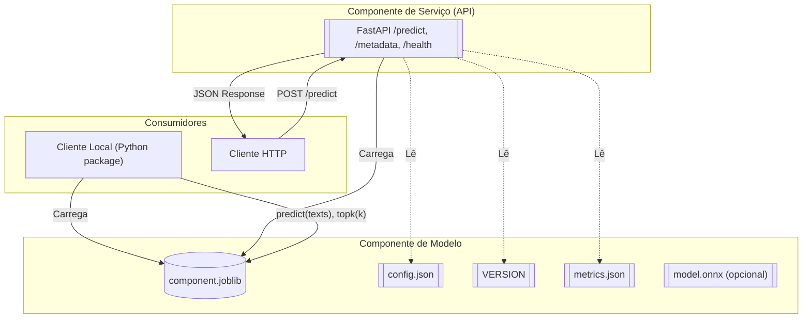

# Diagrama de Componentes e Contratos

Interfaces e formatos principais:
- Componente Local (Python):
  - predict(texts: List[str]) -> List[str]
  - predict_proba(texts: List[str]) -> Optional[List[List[float]]]
  - topk(texts: List[str], k: int) -> List[List[{label, prob}]]
- API HTTP (FastAPI):
  - POST /predict
    - Request: { "texts": [string], "top_k": int }
    - Response: { "predictions": [string], "topk": [[{label, prob}]], "classes": [string], "version": string }
  - GET /metadata → {version, model_name, classes, artifact_dir}
  - GET /health → {status}
