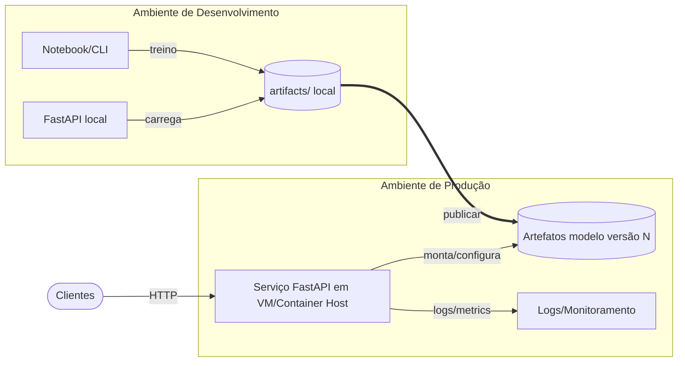

# Diagrama de Implantação

- Consumo local roda no mesmo host do cliente (carrega `artifacts/` diretamente).
- Serviço HTTP roda em host dedicado; em produção, apontado para artefatos publicados e versionados.
- Diferenças dev vs prod: hot-reload, logs verbosos, credenciais e observabilidade.
