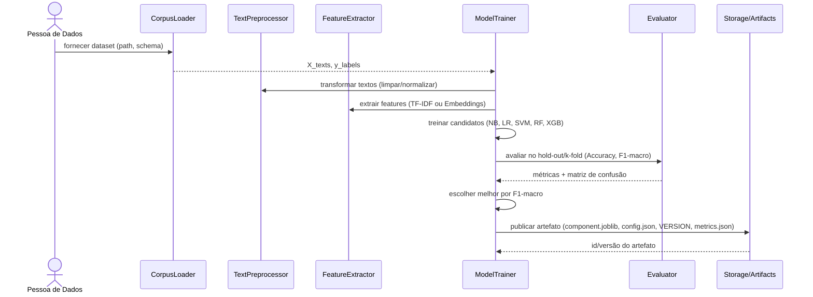
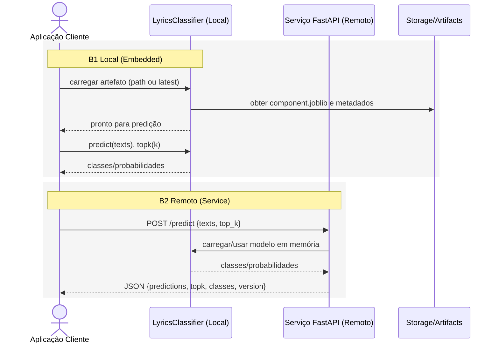

# Diagramas de Sequência

A) Treino/Validação/Publicação

```mermaid
sequenceDiagram
  actor DP as Pessoa de Dados
  participant CL as CorpusLoader
  participant TP as TextPreprocessor
  participant FE as FeatureExtractor
  participant MT as ModelTrainer
  participant EV as Evaluator
  participant ST as Storage/Artifacts

  DP->>CL: fornecer dataset (path, schema)
  CL-->>MT: X_texts, y_labels
  MT->>TP: transformar textos (limpar/normalizar)
  MT->>FE: extrair features (TF-IDF ou Embeddings)
  MT->>MT: treinar candidatos (NB, LR, SVM, RF, XGB)
  MT->>EV: avaliar no hold-out/k-fold (Accuracy, F1-macro)
  EV-->>MT: métricas + matriz de confusão
  MT->>MT: escolher melhor por F1-macro
  MT->>ST: publicar artefato (component.joblib, config.json, VERSION, metrics.json)
  ST-->>MT: id/versão do artefato
```

B) Inferência/Consumo

```mermaid
sequenceDiagram
  actor APP as Aplicação Cliente
  participant LC as LyricsClassifier (Local)
  participant API as Serviço FastAPI (Remoto)
  participant ST as Storage/Artifacts

  rect rgb(245,245,245)
  note over APP,LC: B1 Local (Embedded)
  APP->>LC: carregar artefato (path ou latest)
  LC->>ST: obter component.joblib e metadados
  LC-->>APP: pronto para predição
  APP->>LC: predict(texts), topk(k)
  LC-->>APP: classes/probabilidades
  end

  rect rgb(245,245,245)
  note over APP,API: B2 Remoto (Service)
  APP->>API: POST /predict {texts, top_k}
  API->>LC: carregar/usar modelo em memória
  LC-->>API: classes/probabilidades
  API-->>APP: JSON {predictions, topk, classes, version}
  end
```
