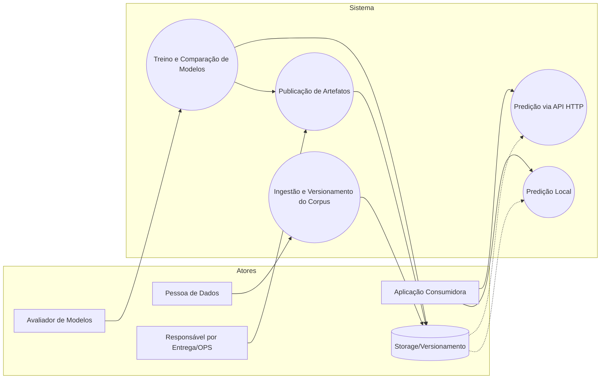

# Casos de Uso (Use Case)

## Especificações Textuais

1) Ingestão e Versionamento do Corpus (UC1)
- Atores: Pessoa de Dados; Sistema de Storage/Versionamento (ex.: Git LFS, S3/minio, SharePoint).
- Objetivo: carregar datasets rotulados (CSV/Parquet) e versionar snapshots do corpus para reprodutibilidade.
- Variações/exceções: arquivo inválido; colunas ausentes; distribuição de classes desbalanceada; atualização incremental.
- Pré-condições: esquema acordado (colunas `lyrics`, `label`); acesso ao storage; política de versionamento definida.
- Pós-condições: dataset validado, salvo e versionado; metadados (hash, data, origem) registrados.

2) Treino e Comparação de Modelos (UC2)
- Atores: Avaliador(a) de Modelos (Cientista/Engenheiro(a) de ML); Storage.
- Objetivo: executar pipeline de pré-processamento → TF-IDF/embeddings → treino (NB, LR, Linear SVM, RF, XGBoost, opcional redes) → validação e seleção por F1-macro.
- Variações/exceções: classe rara; treino sem recursos (memória/GPU); modelo sem `predict_proba` (aplicar calibração); k-fold vs hold-out.
- Pré-condições: corpus versionado; configuração definida; semente fixa.
- Pós-condições: melhor modelo escolhido; métricas exportadas; artefato serializado (joblib e opcional ONNX) com config e VERSION.

3) Predição Local (UC3)
- Atores: Aplicação Consumidora (biblioteca local); Storage.
- Objetivo: carregar artefato `component.joblib` localmente e obter classes/probabilidades.
- Variações/exceções: artefato incompatível; ausência de probabilidade (SVM sem calibração); textos vazios.
- Pré-condições: acesso aos artefatos; runtime Python com dependências.
- Pós-condições: predições e top-k retornados com classes; logs de versão (model_version) disponíveis.

4) Predição via API HTTP (UC4)
- Atores: Aplicação Consumidora; Serviço FastAPI.
- Objetivo: enviar textos e receber predições/probabilidades via `/predict`.
- Variações/exceções: serviço indisponível; timeouts; payload inválido; limitação de `top_k`.
- Pré-condições: serviço em execução apontando para artefato válido; contrato de API documentado.
- Pós-condições: resposta JSON com predições, top-k, classes e versão do modelo.

5) Publicação de Artefatos (UC5)
- Atores: Responsável por Entrega/OPS; Storage; Catálogo Interno (opcional).
- Objetivo: empacotar e publicar o artefato (joblib/ONNX, config, VERSION, metrics) para consumo local e por API.
- Variações/exceções: incompatibilidade de versões; políticas de retenção; rollback.
- Pré-condições: modelo avaliado e aprovado; padrões de naming; controles de acesso.
- Pós-condições: artefato publicado; metadados de versão e changelog atualizados; endpoint apontando para nova versão.
